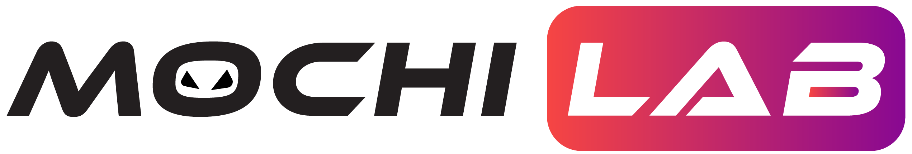

## Introduction 👋

MochiLab is a team dedicated to developing practical and innovative technological
solutions to enable a seamless web3 NFT economy. The MochiLab team is a team of
passionate innovators, researchers, and builders who are committed to bringing
product-market-fit solutions to foster the growth of the NFT economy. We pride
ourselves on delivering the highest quality when it comes to cultivating new roads
in the crypto-space.

Our team combines strong blockchain engineering and research with technical
know-how and pragmatic business acumen. Mochilab is a high achieving and
accomplished team that has won numerous awards and prizes from various blockchain
hackathons, to name a few: Chainlink Hackathon, Defi & Cross-Border Finance, OP
Game Hackathon, Blockstack — Clarity Hackathon, etc, and most recently Binance
Hackathon- the future is now.

MochiLab is an incubator of future innovative DeFi and NFT projects. Currently
under construction is the game changing multi-chain decentralized exchange NFT
ecosystem, a “Super App” for NFTs. Paving the way for the future of NFTs, where
there is a problem, Mochilab has the solution.

## Home Page

[https://mochilab.org](https://mochilab.org)

## License

